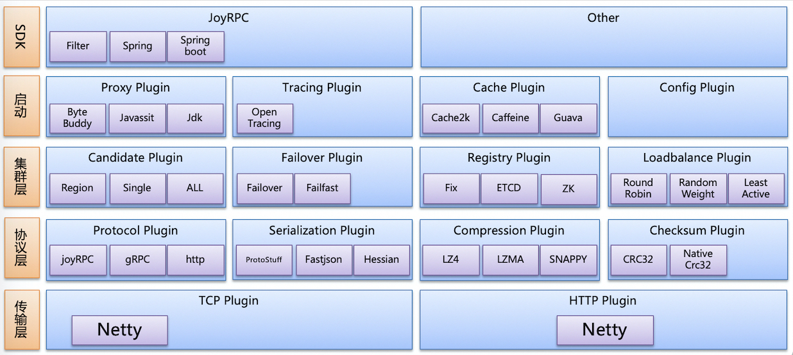

JOYRPC
===

   JOYRPC是一款基于 Java 实现的 RPC 服务框架，是在总结内部服务框架经验的基础上，完全从新设计、支持全异步、微内核和插件化。
   
   
## 主要特性
- 插件体系: 全插件化的RPC框架，我们只是补充了默认实现，所有的核心模块都支持用户自定义。

- 纯异步: 接口完全支持CompletableFuture类型返回值，Provider端业务逻辑可以异步执行，提升服务端吞吐量与调用端吞吐量，Filter调用链全异步化。
- 协商机制: 在连接建立成功后，Consumer和Provider进行协商逻辑，确认协议版本、序列化可用列表、压缩算法列表，保障同协议中，多版本的编解码、序列化、压缩等插件实现的兼容性。
- 多注册中心: Provider端支持多注册中心同时注册,注册中心插件化，默认提供memory注册中心实现，zk、etcd注册中心实现，使用方可自行扩展。
- 插件化多协议: 提供协议插件，默认提供joyrpc协议、http协议、grpc协议(支持与原生grpc相互调用，不用修改java接口，就可以支持grpc调用，（暂不支持grpc的流式调用)，使用方可自行扩展。
- 优雅上下线: Provider发布，将启动与注册逻辑完全分开，先启动，后注册，同时支持接口预热，做到优雅上线。Provider下线，会给Consumer端发送下线通知，后续不会接收到请求，并在处理剩余请求之后关闭端口，做到优雅下线，Consumer端无感知。
- 插件化编解码、序列化、压缩: 解码、序列化、压缩算法全部插件化可扩展，同时使用方可自定义序列化, joyrpc协商机制可保证兼容性。默认hessian协议序列化，兼容性更好。 提供了性能更高的protostuff协议序列化，但对接口设计有要求。 
- 预热权重: Provider端支持接口预热，通过自主实现并配置预测插件，Provider启动时，触发预热插件，调用预热逻辑。Consumer端支持预热权重，通过配置，在新Provder节点启动时，权重逐渐增大，流量也会逐渐增大，保证Consumer端的服务调用可用率
- 增强重试: 更加合理的重试逻辑，做到安全重试，支持重试节点筛选插件，支持业务分组重试。更准确的超时时间，统一的超时时间，每次重试后超时时间递减。
- 自适应负载均衡: Consumer可配置自适应负载均衡，根据Provider节点的TP指标、异常数进行自适应负载控制，保证Provider服务节点与Consumer端的服务调用可用率的稳定性。

## 快速开始
查看[快速开始](./docs/cn/quickstart.md)。

## 配置参考手册
查看[配置参考手册](./docs/cn/config.md)。

## 使用示例
查看[使用示例](./docs/cn/example.md)。

## 常见问题
查看[常见问题](./docs/cn/qa.md)。

## 发布历史
查看[发布历史](./RELEASE.md)。